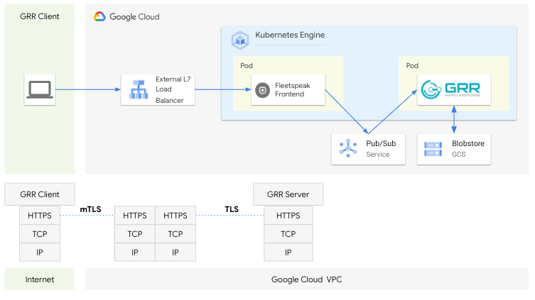

# GRR Helm Chart

[GRR](https://github.com/google/grr) Rapid Response is an incident response framework focused on remote live forensics.

[Overview of GRR](https://grr-doc.readthedocs.io/)

[Chart Source Code](https://github.com/google/osdfir-infrastructure)

Before we get started make sure you clone the repo onto your machine.
```
git clone https://github.com/google/osdfir-infrastructure.git
cd osdfir-infrastructure
export REPO=$(pwd)
```

## TL;DR
> **Tip**: To quickly get started with a local cluster, see [minikube install docs](https://minikube.sigs.k8s.io/docs/start/).

```console
kubectl apply -f charts/grr/mysql.yaml
minikube tunnel &
helm install grr-on-k8s ./charts/grr -f ./charts/grr/values-minikube.yaml
```

> **Note**: For a more real life scenario see [GKE Installations](#61-gke-installations) for deploying GRR on [Google Kubernetes Engine](https://cloud.google.com/kubernetes-engine) (GKE).   

## Introduction

This chart bootstraps a [GRR](https://github.com/google/grr) deployment on a [Kubernetes](https://kubernetes.io) cluster using the [Helm](https://helm.sh) package manager.

## Prerequisites

- [Docker](https://docs.docker.com/engine/install/) 25.0.3+
- [Kubernetes](https://kubernetes.io/) 1.27.8+
- [kubectl](https://kubernetes.io/docs/tasks/tools/install-kubectl) v1.29.2+
- [Helm](https://helm.sh/docs/intro/install/) 3.14.1+
- (optional) [operator-sdk](https://sdk.operatorframework.io/docs/installation/) v1.33.0+

```
minikube start
```

## 1. Setup the MySQL database
Both [GRR](https://github.com/google/grr) and its underlying communication layer [Fleetspeak](https://github.com/google/fleetspeak) need a MySQL database store.   
The following command deploys a container based MySQL instance into the cluster.  
> **Note**: This way to deploy MySQL is only suitable for demo purposes.
```
kubectl apply -f charts/grr/mysql.yaml

# Verify that the MySQL pod is in the the 'Running' status
kubectl get pods -n grr
# The output should look similar to the below:
# NAME                     READY   STATUS    RESTARTS   AGE
# mysql-5cd45cc59f-bgwlv   1/1     Running   0          15s
```

## 2. Setup minikube tunnel
The [minikube tunnel](https://minikube.sigs.k8s.io/docs/commands/tunnel/) feature creates a network route on the host to Kubernetes services using the cluster’s IP address as a gateway.  
The tunnel command exposes the IP address to any program running on the host operating system.
```
minikube tunnel &
```

## 3. Installing the Chart
To install the chart, specify any release name of your choice. For example, using `grr-on-k8s' as the release name, run:

```console
helm install grr-on-k8s ./charts/grr -f ./charts/grr/values-minikube.yaml

# Verify that all the GRR component pods are in 'Running' state (this might take a moment)
kubectl get pods -n grr
# The output should look similar to the below:
# NAME                                      READY   STATUS    RESTARTS   AGE
# dpl-fleetspeak-admin-576754755b-hj27p     1/1     Running   0          1m1s
# dpl-fleetspeak-frontend-78bd9889d-jvb5v   1/1     Running   0          1m1s
# dpl-grr-admin-6b84cd996b-d54zn            1/1     Running   0          1m1s
# dpl-grr-frontend-5fc7f8dc5b-7hsbd         1/1     Running   0          1m1s
# dpl-grr-worker-cc96f574c-kxr9l            1/1     Running   0          1m1s
# mysql-5cd45cc59f-bgwlv                    1/1     Running   0          3m59s
```

The command deploys GRR on the Kubernetes cluster in the default configuration. The [Parameters](#parameters) section lists the parameters that can be configured during installation.

## 4. Deploy a GRR client as a Kubernetes DaemonSet
For test and demo purposes we will deploy a GRR client as a [Kubernetes DaemonSet](https://kubernetes.io/docs/concepts/workloads/controllers/daemonset/).  
To do so we will
- first retrieve the values for some configuration parameters,
- then build a Docker container with the GRR client and its dependencies, and
- finally deploy the container as a DaemonSet.

### 4.1. Retrieve the configuration parameter values
```
cd charts/grr/containers/grr-daemon/
export FLEETSPEAK_FRONTEND_ADDRESS="fleetspeak-frontend"
export FLEETSPEAK_FRONTEND_IP=$(kubectl get svc -n grr svc-fleetspeak-frontend --output jsonpath='{.spec.clusterIP}')
export FLEETSPEAK_FRONTEND_PORT=4443
export FLEETSPEAK_CERT=$(openssl s_client -showcerts -nocommands -connect \
                         $FLEETSPEAK_FRONTEND_IP:$FLEETSPEAK_FRONTEND_PORT< /dev/null | \
                         openssl x509 -outform pem | sed ':a;N;$!ba;s/\n/\\\\n/g')
sed "s'FLEETSPEAK_FRONTEND_ADDRESS'$FLEETSPEAK_FRONTEND_ADDRESS'g" config/config.textproto.tmpl > config/config.textproto
sed -i "s'FLEETSPEAK_FRONTEND_PORT'$FLEETSPEAK_FRONTEND_PORT'" config/config.textproto
sed -i "s'FRONTEND_TRUSTED_CERTIFICATES'\"$FLEETSPEAK_CERT\"'g" config/config.textproto
```

### 4.2. Build the GRR client Docker container
```
eval $(minikube docker-env)
docker build -t grr-daemon:v0.1 .
```

### 4.3. Deploy the GRR client DaemonSet
```
kubectl label nodes minikube grrclient=installed

# Verify that the GRR client DaemonSet got deployed.
kubectl get daemonset -n grr-client
# The output should look similar to the below:
# NAME   DESIRED   CURRENT   READY   UP-TO-DATE   AVAILABLE   NODE SELECTOR         AGE
# grr    1         1         1       1            1           grrclient=installed   53s
```

## 5. Connect to the GRR Admin Frontend
You can now point your browser to the GRR Admin Frontend to investigate the node with the GRR client.
```
export GRR_ADMIN_IP=$(kubectl get svc svc-grr-admin -n grr --output jsonpath='{.spec.clusterIP}')
```
The GRR Admin Frontend can now be reached on the following URL (note that you might have to tunnel to your server first):   
[http://${GRR_ADMIN_IP}:8000](http://${GRR_ADMIN_IP}:8000)

## 6. Installing on Cloud
After installing GRR on minikube and kicking the tires you likely aim for running GRR in a more real life scenario.  
For this you could consider installing GRR on a managed Kubernetes cluster in the cloud like on [Google Cloud's Kubernetes Engine](https://cloud.google.com/kubernetes-engine) (GKE).  
We have you covered by documenting two flavours below on how you can quickly get up to speed with a GKE based GRR installation:
- GRR on GKE with layer 4 load balancer (TODO)
- GRR on GKE with layer 7 load balancer

`

Your choice of load balancer will determine how your GRR client fleet communicates with GRR's [Fleetspeak](https://github.com/google/fleetspeak) based communication layer.  
You can find more details and background on the different modes of exposing GRR's Fleetspeak based communication layer in this [blog post](https://osdfir.blogspot.com/2023/12/running-grr-everywhrr.html).

### 6.1. GKE Installations
Before we can install GRR we need to provision a GKE cluster and its related infrastructure.  
The quickest way to provision a ready to run environment on Google Cloud is by following the steps in these [installation instructions](../../cloud/README.md).  

We recommend that you start with cloning this repo again to avoid carrying over any configurations from the minikube based instructions above.
```
git clone https://github.com/google/osdfir-infrastructure.git
cd osdfir-infrastructure
export REPO=$(pwd)
```
Once you have provisioned your infrastructure you can continue with the instructions below.   

### 6.2. Install GRR on GKE
In case you followed the Google Cloud environment installation instructions you should already have the following environment variables configured.  
Otherwise, either run the [installation instruction step](../../cloud/README.md#22-capture-environment-variables-for-later-use) again or set the environment variables to values that match your setup.  
You can check that they have a value assigned by runnig the commands below.
```
echo "FLEETSPEAK_FRONTEND: $FLEETSPEAK_FRONTEND"
echo "GKE_CLUSTER_LOCATION: $GKE_CLUSTER_LOCATION"
echo "GKE_CLUSTER_NAME: $GKE_CLUSTER_NAME"
echo "GRR_DAEMON_IMAGE: $GRR_DAEMON_IMAGE"
echo "GRR_OPERATOR_IMAGE: $GRR_OPERATOR_IMAGE"
echo "LOADBALANCER_CERT: $LOADBALANCER_CERT"
echo "MYSQL_DB_ADDRESS: $MYSQL_DB_ADDRESS"
echo "PROJECT_ID: $PROJECT_ID"
echo "REGION: $REGION"
```

#### 6.2.1. Build the GRR daemon container image
```
cd $REPO/charts/grr/containers/grr-daemon
export FLEETSPEAK_FRONTEND_PORT=443
sed "s'FLEETSPEAK_FRONTEND_ADDRESS'$FLEETSPEAK_FRONTEND'g" config/config.textproto.tmpl > config/config.textproto
sed -i "s'FLEETSPEAK_FRONTEND_PORT'$FLEETSPEAK_FRONTEND_PORT'" config/config.textproto
sed -i "s'FRONTEND_TRUSTED_CERTIFICATES'$LOADBALANCER_CERT'g" config/config.textproto
echo 'client_certificate_header: "client-certificate"' >> config/config.textproto
gcloud builds submit --region=$REGION --tag $GRR_DAEMON_IMAGE

cd $REPO
```

#### 6.2.2. Deploy the application on GKE
In this section we cover two alternative options to install GRR on GKE (or Kubernetes in general).
- Option 1: Install GRR with ```helm```.
- Option 2: Install GRR with a [Kubernetes Operator](https://kubernetes.io/docs/concepts/extend-kubernetes/operator/).

##### 6.2.2.1. Fetch the GKE cluster credentials
```
gcloud container clusters get-credentials $GKE_CLUSTER_NAME --zone $GKE_CLUSTER_LOCATION --project $PROJECT_ID
```

##### 6.2.2.2. Set the default values for the GRR chart
> **Note**: The Google Cloud environment [installation Terraform script](../../cloud/README.md#21-setup-the-platform-infrasturcture) has provisioned a managed [Cloud SQL for MySQL](https://cloud.google.com/sql/mysql) database. In case to choose to self host the MySQL database you can run the [steps above](#1-setup-the-mysql-database). Make sure you adjust the ```MYSQL_DB_ADDRESS``` in the commands below accordingly.

```
sed -i "s'FLEETSPEAK_DB_ADDRESS'$MYSQL_DB_ADDRESS'g" charts/grr/values.yaml
sed -i "s'GRR_DAEMON_IMAGE'$GRR_DAEMON_IMAGE'g" charts/grr/values.yaml
sed -i "s'GRR_DB_ADDRESS'$MYSQL_DB_ADDRESS'g" charts/grr/values.yaml
```

##### 6.2.2.3. Option 1: Install GRR with helm
```
helm install grr-on-k8s ./charts/grr -f ./charts/grr/values.yaml
```

##### 6.2.2.4. Option 2: Install GRR with Kubernetes Operator
In case you choose to use this installation option you need to have the ```operator-sdk``` CLI installed on your machine.   
Follow the steps in the [installation guide](https://sdk.operatorframework.io/docs/installation/) to learn how to install the ```operator-sdk``` CLI tool.

###### 6.2.2.4.1. Build and install the operator
This needs to be done only once.
```
# Create the helm-based grr-operator
mkdir grr-operator
cd grr-operator
operator-sdk init --plugins helm --domain grr-response.com --group grr --helm-chart ../charts/grr

# Build and install the controller
make IMG=$GRR_OPERATOR_IMAGE docker-build docker-push
make IMG=$GRR_OPERATOR_IMAGE deploy

# Check that the controller is in the 'Running' status.
kubectl get pods -n grr-operator-system
# The output should look something like the below:
# NAME                                             READY STATUS  RESTARTS AGE
# grr-operator-controller-manager-5574fc9979-h8bd6 2/2   Running 0        42s
```

###### 6.2.2.4.2. Install GRR with the Custom Resource
This will create a GRR [Custom Resource](https://kubernetes.io/docs/concepts/extend-kubernetes/api-extension/custom-resources/) that the [Controller](https://kubernetes.io/docs/concepts/extend-kubernetes/api-extension/custom-resources/#custom-controllers) will pick up and instantiate.
```
# Install GRR
kubectl apply -f config/samples/grr_v1alpha1_grr.yaml

cd $REPO
```

##### 6.2.2.5. Wait for all GRR pods to be in 'Running' status
```
# Check that all the pods are in the 'Running' status.
kubectl get pods -n grr
# The output should look something like the below:
# NAME                                     READY STATUS  RESTARTS AGE
# dpl-fleetspeak-admin-7f5c6ff877-4x89d    1/1   Running 0        1m34s
# dpl-fleetspeak-frontend-856dd98bf5-ljhds 1/1   Running 0        1m34s
# dpl-grr-admin-78b67cfc76-rjwp2           1/1   Running 0        1m33s
# dpl-grr-frontend-69fd89c495-vlk54        1/1   Running 0        1m34s
# dpl-grr-worker-7d69984fc8-z82k7          1/1   Running 0        1m33s
```
 
#### 6.3. Add the NEG to the Backend Service
This step is very important. We need to add the Standalone Network Endpoint Group (NEG) to the Backend Service of our GLB7.   
See the [Google Cloud online docs](https://cloud.google.com/kubernetes-engine/docs/how-to/standalone-neg#standalone_negs) for more info on Standalone NEGs.

Both GKE and the Terraform scripts have done their half.
It is our job to glue them together.

```
# Get the NEG
gcloud compute network-endpoint-groups list
# The output should look something like the below:
# NAME: k8s-fleetspeak-frontend-neg
# LOCATION: europe-west1-b
# ENDPOINT_TYPE: GCE_VM_IP_PORT
# SIZE: 1

# Get the Backend Service
# The output should look something like the below:
gcloud compute backend-services list
# NAME: l7-xlb-backend-service
# BACKENDS: 
# PROTOCOL: HTTPS

# Add the NEG to the Backend Service
gcloud compute backend-services add-backend l7-xlb-backend-service \
  --global \
  --network-endpoint-group=k8s-fleetspeak-frontend-neg \
  --network-endpoint-group-zone=europe-west1-b \
  --balancing-mode RATE \
  --max-rate-per-endpoint 5
```

## 7. Testing
Let's go and test the setup.  
To do so we need three things:
- Create a GRR client, and
- Access to the GRR Admin UI

### 7.1. Deploy the GRR client
This will spin up a pod with the GRR client as a daemonset on the selected node.  
We can interact with in the next step.

```
# Find your node names
kubectl get nodes
# The output should look similar to the below:
# NAME                                             STATUS   ROLES    AGE   VERSION
# gke-osdfir-cluster-grr-node-pool-7b71cc80-s84g   Ready    <none>   18m   v1.27.8-gke.1067004
# gke-osdfir-cluster-grr-node-pool-7b71cc80-z8wp   Ready    <none>   18m   v1.27.8-gke.1067004

# Chose one of the node names and replace it in the command below.
# Then run the below command to label the node so it receives a grr daemonset.
kubectl label nodes gke-osdfir-cluster-grr-node-pool-7b71cc80-s84g grrclient=installed

# This will trigger the grr daemonset to be deployed to this node.
# You can check that the daemonset is running by issueing the command below:
kubectl get daemonset -n grr-client
# The output should look something like the below:
# NAME DESIRED CURRENT READY UP-TO-DATE AVAILABLE NODE SELECTOR       AGE
# grr  1       1       1     1          1         grrclient=installed 15m

# You can also check that the pod is in the 'Running' status.
kubectl get pods -n grr-client
# The output should look something like the below:
# NAME      READY STATUS  RESTARTS AGE
# grr-7cc7l 1/1   Running 0        13s
```

### 7.2. Create a tunnel to access the GRR Admin UI
```
gcloud container clusters get-credentials $GKE_CLUSTER_NAME --zone $GKE_CLUSTER_LOCATION --project $PROJECT_ID \
 && kubectl port-forward -n grr \
    $(kubectl get pod -n grr --selector="app.kubernetes.io/name=grr-admin" --output jsonpath='{.items[0].metadata.name}') 8000:8000
```
You can now point your browser at: http://127.0.0.1:8000 to access the GRR Admin UI.   

In case you would like to test collecting ```containerd``` forensic artifacts then you can upload the ```ContainerdArtifacts.yaml``` definition file.   
This file contains an artifact group with a set of 6 ```containerd``` specific artifacts.   
Note: These artifacts are enabled in the container image we use for the ```daemonset``` based GRR client we installed above.   
You will not be able to run these artifacts on a 'standard' GRR client.

## 8. Cleaning up
We recommend that you clean up the installation after you are done with your testing to avoid any future charges.  
To do so you have two options to clean up the installation.
1. Delete the Google Cloud Project and with it all the resources contained in it.
2. Build back sequentially what we installed (this can be useful in case you want to make some adjustments and re-install bits an pieces).

### 8.1. Delete the Google Cloud Project
You can delete the entire Google Cloud Project (and all resources contained in it) by going to the [Resource Manager](https://console.cloud.google.com/cloud-resource-manager), select your Project and delete it (you will need to confirm your action by copying the Project ID).  
You can find more info in the [online documentation](https://cloud.google.com/resource-manager/docs/creating-managing-projects#shutting_down_projects).

### 8.2. Build back sequentially
Sequentially building back the installation can be useful for cases where you would like to make some adjustments to your current installtion.  
For such cases just build back as far as needed to make your adjustments and then roll forward the installation again following the original instructions.

Here is the full set of steps to do a sequential build back:
```
# Rempove the NEG from the Backend Service
gcloud compute backend-services remove-backend l7-xlb-backend-service \
  --global \
  --network-endpoint-group=k8s-fleetspeak-frontend-neg \
  --network-endpoint-group-zone=europe-west1-b

# Remove the GRR client (daemonset)
# Make sure you substitue the node name with your value
kubectl label nodes --overwrite gke-osdfir-cluster-grr-node-pool-7b71cc80-s84g grrclient=

# Remove the GRR application (make sure you are in the grr-operator directory)
cd grr-operator # optional in case you are not in the grr-operator directory yet
kubectl delete -f config/samples/grr_v1alpha1_grr.yaml

# Remove the GRR operator
make undeploy
```

## 9. Uninstalling the Chart

To uninstall/delete a Helm deployment with a release name of `grr-on-k8s`:

```
helm uninstall grr-on-k8s
```

> **Tip**: Please update based on the release name chosen. You can list all releases using `helm list`

## Parameters

### Global parameters

| Name                            | Description                                                                                  | Value   |
| ------------------------------- | -------------------------------------------------------------------------------------------- | ------- |
| ``                              |                                                                                              | ``      |

### GRR configuration

| Name                                | Description                                                                                  | Value       |
| ----------------------------------- | -------------------------------------------------------------------------------------------- | ----------- |
| ``                                  |                                                                                              | ``          |

### Common Parameters

| Name                                | Description                                                                                  | Value       |
| ----------------------------------- | -------------------------------------------------------------------------------------------- | ----------- |
| ``                                  |                                                                                              | ``          |

### Third Party Configuration

| Name                                | Description                                                                                  | Value       |
| ----------------------------------- | -------------------------------------------------------------------------------------------- | ----------- |
| ``                                  |                                                                                              | ``          |

## License

Copyright &copy; 2024 OSDFIR Infrastructure

Licensed under the Apache License, Version 2.0 (the "License");
you may not use this file except in compliance with the License.
You may obtain a copy of the License at

<http://www.apache.org/licenses/LICENSE-2.0>

Unless required by applicable law or agreed to in writing, software
distributed under the License is distributed on an "AS IS" BASIS,
WITHOUT WARRANTIES OR CONDITIONS OF ANY KIND, either express or implied.
See the License for the specific language governing permissions and
limitations under the License.
