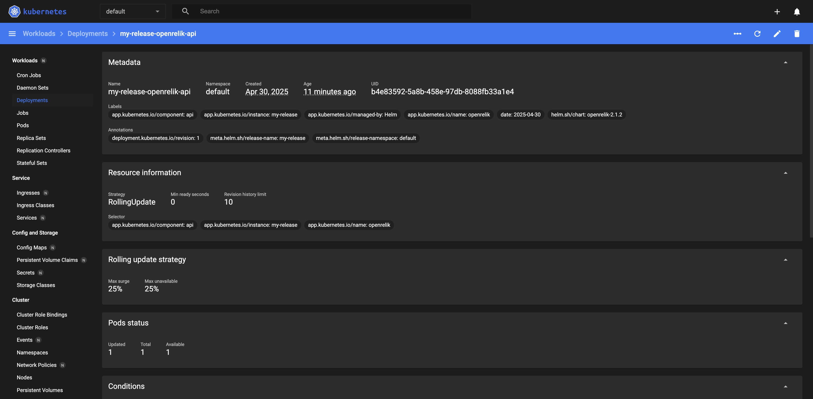

## Get Started with OSDFIR Infrastructure Using Minikube

### Introduction

In recent years, containers have become the definitive way to develop applications because they provide packages that contain everything you need to run your applications: code, runtime, databases, system libraries, etc.

[Kubernetes](https://kubernetes.io/) is an open source solution for managing application containers. With Kubernetes, you can decide when your containers should run, increase, or decrease the size of application containers or check the resource consumption of your application deployments. The Kubernetes project is based on Google's experience working with containers, and it is gaining momentum as the easiest and the most recommended way to manage containers in production.

Applications can be installed in Kubernetes using [Helm charts](https://helm.sh/). Helm charts are packages that contain all the information that Kubernetes needs to know for managing a specific application within the cluster.

This guide will walk you, step by step, through the process of deploying applications within a Kubernetes cluster using [OSDFIR Infrastructure Helm charts](https://github.com/google/osdfir-infrastructure/tree/main/charts).

### Introducing Kubernetes

Kubernetes is an open source project designed specifically for container orchestration. Kubernetes offers a number of [key features](https://kubernetes.io/docs/whatisk8s/), including multiple storage APIs, container health checks, manual or automatic scaling, rolling upgrades and service discovery. Applications can be installed to a Kubernetes cluster via [Helm charts](https://helm.sh/), which provides streamlined package management functions.

#### Kubernetes Native App architecture

The architecture of a typical Cloud-Native application consists of 3-tiers: a persistence or database tier, backend tier and frontend tier for your application.
In Kubernetes, you define and create multiple resources for each of these tiers.

#### Working with Kubernetes

Kubernetes is platform-agnostic and integrates with a number of different cloud providers, allowing you to pick the platform that best suits your needs. Check [Kubernetes official documentation](https://kubernetes.io/docs/getting-started-guides/) to find out the right solution for you.

There are two different interfaces from which you can manage the resources on your cluster:

* Kubernetes command line interface: [kubectl](https://kubernetes.io/docs/reference/kubectl/)
* Kubernetes web-based user interface: [Dashboard](https://kubernetes.io/docs/tasks/access-application-cluster/web-ui-dashboard/)

### Introducing Helm

The official [Helm](https://helm.sh/) webpage defines Helm as a "package manager for Kubernetes" but, it is more than this. Helm is a tool for managing applications that run in the Kubernetes cluster manager. Helm provides a set of operations that are useful for managing applications, such as: inspect, install, upgrade and uninstall.

#### Helm Charts: applications ready-to-deploy

Helm charts are packages of pre-configured Kubernetes resources. A Helm chart describes how to manage a specific application on Kubernetes. It consists of metadata that describes the application, plus the infrastructure needed to operate it in terms of the standard Kubernetes primitives. Each chart references one or more (typically Docker-compatible) container images that contain the application code to be run.

Helm charts contains at least these two elements:

* A description of the package (*chart.yml*).
* One or more templates, which contains Kubernetes manifest files.

Despite the fact you can run application containers using the Kubernetes command line (*kubectl*), the easiest way to run workloads in Kubernetes is using the ready-made Helm charts. Helm charts simply indicate to Kubernetes how to perform the application deployment and how to manage the container clusters.

OSDFIR Infrastructure offers a number of stable, production-ready Helm charts to deploy popular Digital Forensics & Incident Response (DFIR) tools with ease and confidence.

### Overview

[Minikube](https://kubernetes.io/docs/getting-started-guides/minikube/) is the official way to run Kubernetes locally. It is a tool that runs a single-node Kubernetes cluster inside a Virtual Machine (VM) on your computer. It is an easy way to try out Kubernetes and is also useful for testing and development scenarios.

In this tutorial, you will learn how to install the needed requirements to run OSDFIR Infrastructure on Kubernetes using Minikube. If you would like to provision a GKE cluster in GCP instead, please see the [init-gke.sh](../tools/init-gke.sh) helper script.

Here are the steps you'll follow in this tutorial:

* [Configure the platform](#step-1-configure-the-platform)
* [Create a Kubernetes cluster](#step-2-create-a-kubernetes-cluster)
* [Install the *kubectl* command-line tool](#step-3-install-the-kubectl-command-line-tool)
* [Install and configure Helm](#step-4-install-and-configure-helm)
* [Install an application using a Helm chart](#step-5-install-an-application-using-a-helm-chart)
* [Access the Kubernetes Dashboard](#step-6-access-the-kubernetes-dashboard)
* [Uninstall an application using Helm](#step-7-uninstall-an-application-using-helm)

The next sections will walk you through these steps in detail.

### Assumptions and prerequisites

This guide focuses on deploying OSDFIR Infrastructure in a Kubernetes cluster running on Minikube. The example applications within OSDFIR Infrastructure are [Timesketch](https://github.com/google/timesketch), [Turbinia](https://github.com/google/turbinia), and [dfTimewolf](https://github.com/log2timeline/dftimewolf) integration with these applications.

This guide assumes that you have a virtualization software such as [Docker](https://www.docker.com/), [KVM](https://www.linux-kvm.org/page/Downloads), or [VirtualBox](https://www.virtualbox.org/wiki/Downloads) installed and running on your computer. For more examples, see the official [Minikube docs](https://minikube.sigs.k8s.io/docs/start/).

### Step 1: Configure the platform

The first step for working with local Kubernetes clusters is to have Minikube installed.

To install Minikube, please see the official [Minikube installation guide](https://minikube.sigs.k8s.io/docs/start/).

### Step 2: Create a Kubernetes cluster

By starting Minikube, a single-node cluster is created. Run the following command in your terminal to complete the creation of the cluster:

```shell
$ minikube start
```

To run your commands against Kubernetes clusters, the *kubectl* CLI is needed. Check step 3 to complete the installation of *kubectl*.

### Step 3: Install the *kubectl* command-line tool

In order to start working on a Kubernetes cluster, it is necessary to install the Kubernetes command line (*kubectl*).

To install kubectl, please see the official [kubectl installation guide](https://kubernetes.io/docs/tasks/tools/).

> TIP: Once the *kubectl* CLI is installed, you can obtain information about the current version with the *kubectl version* command. You can also install *kubectl* by using the *sudo apt-get install kubectl* command.

* Check that *kubectl* is correctly installed and configured by running the *kubectl cluster-info* command:

    ```shell
    $ kubectl cluster-info
    ```

    

    > NOTE: The *kubectl cluster-info* command shows the IP addresses of the Kubernetes node master and its services.

* You can also verify the cluster by checking the nodes. Use the following command to list the connected nodes:

    ```shell
    $ kubectl get nodes
    ```

* To get complete information on each node, run the following:

    ```shell
    $ kubectl describe node
    ```

[Learn more about the *kubectl* CLI](https://kubernetes.io/docs/user-guide/kubectl-overview/).

### Step 4: Install and configure Helm

The easiest way to run and manage applications in a Kubernetes cluster is using Helm. Helm allows you to perform key operations for managing applications such as install, upgrade or delete.

To install Helm, please see the official [Helm installation guide](https://helm.sh/docs/intro/install/).

### Step 5: Install an application using a Helm Chart

A Helm chart describes a specific version of an application, also known as a "release". The "release" includes files with Kubernetes-needed resources and files that describe the installation, configuration, usage and license of a chart.

The steps below show how to run the following OSDFIR Infrastucture tools using Helm charts:

* [OSDFIR Infrastructure](https://github.com/google/osdfir-infrastructure/tree/main/charts/osdfir-infrastructure)
* [Turbinia](https://github.com/google/osdfir-infrastructure/tree/main/charts/turbinia)
* [Timesketch](https://github.com/google/osdfir-infrastructure/tree/main/charts/timesketch)

By executing the *helm install* command the application will be deployed on the Kubernetes cluster. You can install more than one chart across the cluster or clusters. We recommend installing and using the main OSDFIR Infrastructure charts as it deploys and integrates multiple DFIR tools together.

> IMPORTANT: If you don't specify a release name, one will be automatically assigned.

The first step will be to add the repo and then update to pick up any new changes that were made to
the Helm charts.

```console
helm repo add osdfir-charts https://google.github.io/osdfir-infrastructure/
helm repo update
```

To install the chart, specify any release name of your choice. For example, to install OSDFIR Infrastructure using a release name of `my-release`, run:

```shell
$ helm install my-release osdfir-charts/osdfir-infrastructure
```

> NOTE: Check the configurable parameters of the OSDFIR Infrastructure chart and their default values at the [GitHub repository](https://github.com/google/osdfir-infrastructure/tree/main/charts/osdfir-infrastructure#parameters).

Once you have the chart installed a "Notes" section will be shown at the bottom of the installation information. It contains important instructions about how to access Turbinia and Timesketch and retrieve credentials. Please check it carefully:


> IMPORTANT: When installing the Helm chart then running *kubectl get pods* immediately after, you may see errors such as *CrashLoopBackOff* and your application may fail to start. This is typically because the Persistent Volumes are still provisioning or the docker images are still being pulled and may need to wait a few minutes for the error to resolve.

Find how to install Turbinia or Timesketch in the examples below:

* To install Turbinia on Minikube with a release name of `my-release`, run:

    ```shell
    $ helm install my-release osdfir-charts/turbinia
    ```

    > NOTE: Check the configurable parameters of the Turbinia chart and their default values at the [GitHub repository](https://github.com/google/osdfir-infrastructure/tree/main/charts/turbinia#parameters).

* To install Timesketch on Minikube with a release name of `my-release`, run:

    ```shell
    $ helm install my-release osdfir-charts/timesketch
    ```

    > NOTE: Check the configurable parameters of the Timesketch chart and their default values at the [GitHub repository](https://github.com/google/osdfir-infrastructure/tree/main/charts/timesketch#parameters).

Now, you can manage your deployments from the Kubernetes Dashboard. Follow the instructions below to access the Web user interface.

### Step 6: Access the Kubernetes Dashboard

The [Kubernetes Dashboard](https://github.com/kubernetes/dashboard) is a Web user interface from which you can manage your clusters in a more simple and digestible way. It provides information on the cluster state, deployments and container resources. You can also check both the credentials and the log error file of each pod within the deployment.

To get a URL for the Kubernetes Dashboard, run the following command:

```shell
$ minikube dashboard --url
```

With this command, you will be redirected automatically to the Kubernetes Dashboard. The home screen shows the "Workloads" section. Here you get an overview of the following cluster elements:

* CPU usage
* Memory usage
* Deployments
* Replica Sets
* Pods


From this home screen, you can perform some basic actions such as:

* Monitoring the status of your deployments and pods.
* Checking pod and container(s) logs to identify possible errors during the creation of the containers.
* Finding application credentials.

#### Monitor the status of Deployments and Pods

##### Monitor Deployments

* To check detailed information about the status of your deployments, navigate to the "Workloads -> Deployments" section located on the left menu. It shows a screen with a graphical representation of the CPU and memory usage, as well as a list of all deployments you have in your cluster.


* Click each deployment to obtain detailed information of the selected deployment:



Alternatively, you can grab the equivalent deployment information using kubectl:

```shell
$ kubectl get deployments
```

For detailed information around a given deployment, replacing DEPLOYMENT_NAME
with the deployment you want to inspect:

```shell
$ kubectl describe deployment DEPLOYMENT_NAME
```

##### Monitoring pods

Pods are the smallest units in Kubernetes deployments. They can contain one or multiple containers (that need to share resources in order to work together). [Learn more about pods](https://kubernetes.io/docs/concepts/workloads/pods/).

When you click on a pod in the "Workloads -> Pods", you access the pod list. By selecting a pod, you will see the "Details" section that contains information related to the pod,and a "Containers" section that includes the information related to this pod's container(s).

Follow these instructions to access pod and container information:

* To check the status of your deployments in detail, navigate to the "Workloads -> Pods" section located on the left menu. It shows the pod list:


* Click the pod you'd like to access further details for.


* As indicated in the image above, you will find a "View logs" link and a "Exec into pod" link at the top right corner. Click either option to review logs for possible errors that might have occurred or to directly access the pod itself.

Alternatively, you can grab the equivalent Pod information using kubectl:

```shell
$ kubectl get pods
```

For detailed information around a given pod, replacing POD_NAME
with the pod you want to inspect:

```shell
$ kubectl describe pod POD_NAME
```

For logs around a given pod, replacing POD_NAME
with the pod you want to grab logs from:

```shell
$ kubectl logs POD_NAME
```

For a shell directly into the pod, replacing POD_NAME with the pod you want to exec into:

```shell
$ kubectl exec --stdin --tty POD_NAME -- /bin/bash
```

#### Find application credentials

The Timesketch login  credentials are shown in the "Notes" section after installing the application chart:


> NOTE: When deploying the Turbinia Helm chart with the Oauth2 Proxy enabled, you will see an additional secret for the Turbinia Oauth2 config.

Alternatively, to get it from the Kubernetes Dashboard, follow these instructions:

* Navigate to the "Config and Storage -> Secrets" section located on the left menu.

* Click the application for which you wish to obtain the credentials.

* In the "Data" section, click the eye icon to see the password:


### Step 7: Uninstall an application using Helm

To uninstall an application, you need to run the *helm uninstall* command. Every Kubernetes resource that is tied to that release will be removed except for Persistent Volumes.

> TIP: To get the release name, you can run the *helm list* command.

```shell
    $ helm uninstall my-release
```

> NOTE: Remember that `my-release` is a placeholder, replace it with the name you have used during the chart installation process.

To delete all Persistent Volumes in the cluster, run:

```shell
$ kubectl delete pvc --all
$ kubectl delete pv --all
```

To delete a specific Persistent Volume instead, first run the following commands to get the name of the Persistent Volume Claim and Persistent Volume you want to delete:

```shell
$ kubectl get pvc
$ kubectl get pv
```

Then, replace the `PVC-NAME` and `PV-NAME` placeholder with the names you got from the previous command and run the following commands to delete the Persistent Volume Claim and Persistent Volume:

```shell
$ kubectl delete pvc PVC-NAME
$ kubectl delete pv PV-NAME
```

To delete the Minikube cluster and associated resources, run:

```shell
$ minikube delete --all
```

### Useful links

To learn more about the topics discussed in this guide, use the links below:

* [Minikube](https://github.com/kubernetes/minikube)
* [Google Kubernetes Engine](https://cloud.google.com/container-engine/)
* [Kubernetes](https://kubernetes.io/)
* [Kubectl Cheat Sheet](https://kubernetes.io/docs/reference/kubectl/cheatsheet/)
* [Kubectl for Docker users](https://kubernetes.io/docs/reference/kubectl/docker-cli-to-kubectl/)
* [Helm](https://helm.sh/)
